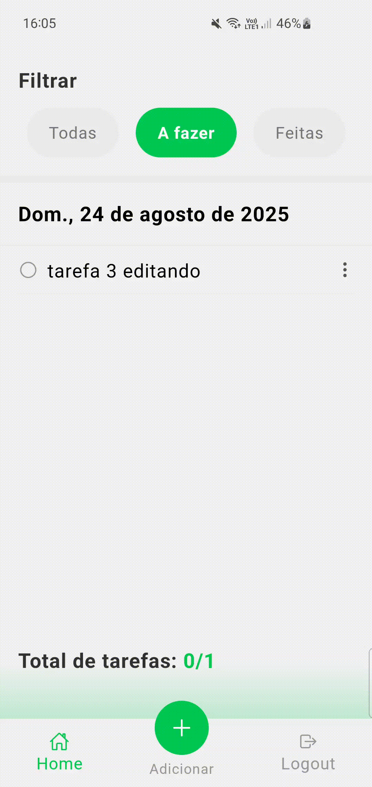

# To-Do List App - Desafio Mobile


## 📑 Sobre o Projeto

Este é um aplicativo de lista de tarefas (To-Do List) desenvolvido para cumprir os requisitos de um desafio de desenvolvimento mobile com React Native. 
A aplicação permite que os usuários se cadastrem, façam login e gerenciem as suas tarefas diárias de forma persistente e individual, seguindo uma especificação de design e funcionalidades.

O projeto foi construído utilizando um stack moderno, incluindo **Expo**, **React Native** e **TypeScript**.

---
## 📱 Demonstração em Vídeo

Aqui você pode ver um vídeo curto demonstrando as principais funcionalidades do aplicativo:

<a href="./assets/app-demo.gif">

</a>

---
## ✅ Checklist de Funcionalidades do Desafio

Abaixo estão detalhados os requisitos do desafio e como foram implementados na aplicação.

### 1. Login e Cadastro

-   **Requisito:** Tela de login simples com email e senha.
-   **Implementação:** ✅ Realizada. Foi criada uma tela de login e uma tela de cadastro, com validação de formulário e gestão de estado para os inputs.

-   **Requisito:** Mensagem de erro para login inválido ou senha errada.
-   **Implementação:** ✅ Realizada. A aplicação consulta uma API Falsa local (`AsyncStorage`) e exibe um alerta nativo caso as credenciais não correspondam a um utilizador registado.

<br>

*Demonstração do fluxo de autenticação:*


---

### 2. Lista de Tarefas (To-Do List)

-   **Requisito:** Apresentada após o login, com dados lidos via API.
-   **Implementação:** ✅ Realizada. A tela Home busca e exibe apenas as tarefas pertencentes ao usuário que fez o login.

-   **Requisito:** Modal com detalhes da tarefa ao clicar (ID, Descrição, Datas, Status).
-   **Implementação:** ✅ Realizada. Um modal é aberto ao clicar numa tarefa, exibindo a descrição completa, data de criação e da última atualização, e o seu estado atual (Concluída ou A fazer).

-   **Requisito:** Menu dropdown ao pressionar longamente uma tarefa.
-   **Implementação:** ✅ Realizada. Um menu de ações customizado aparece sobre a tarefa selecionada, com opções para Editar, Concluir e Excluir.

-   **Requisito:** Opções no dropdown: Editar, Excluir (com alerta de confirmação) e Marcar como concluída.
-   **Implementação:** ✅ Todas as ações foram implementadas. A exclusão de uma tarefa dispara um alerta de confirmação para prevenir ações acidentais.

-   **Requisito:** Contador de tarefas no rodapé (total, completas, a fazer).
-   **Implementação:** ✅ Realizado. O rodapé da lista exibe um contador que é atualizado em tempo real.

-   **Requisto:** Filtros para tarefas completas e não completas.
-   **Implementação:** ✅ Realizado. Botões no topo da lista permitem filtrar a visualização entre "Todas", "A fazer" e "Feitas".

<br>

*Demonstração da Lista de Tarefas e suas interações:*


---

### 3. Cadastrar Tarefa

-   **Requisito:** Formulário para cadastrar uma nova tarefa.
-   **Implementação:** ✅ Realizado. Um modal é aberto através de um botão flutuante, contendo um campo para a descrição da nova tarefa.

-   **Requisito:** A tarefa deve ser criada com o status `completed = false`.
-   **Implementação:** ✅ Realizado. Toda nova tarefa é criada por defeito como "A fazer".

-   **Requisito:** O botão de salvar deve voltar para a lista de tarefas, já com o novo item visível.
-   **Implementação:** ✅ Realizado. Após a criação, o modal fecha-se e a lista na tela Home é automaticamente recarregada para exibir a nova tarefa.

<br>

*Demonstração da Criação de Tarefas:*



---

## 🚀 Como Executar o Projeto

Para executar este projeto localmente, você precisará de ter o Node.js, npm (ou yarn) e o Git instalados. Para o ambiente de teste, um emulador Android (via Android Studio) ou um dispositivo físico (iOS ou Android) é necessário.

### Pré-requisitos

-   [Node.js (versão LTS recomendada)](https://nodejs.org/en/)
-   [Yarn](https://classic.yarnpkg.com/en/docs/install/) (Opcional, pode usar o `npm`)
-   [Git](https://git-scm.com/)
-   [Android Studio](https://developer.android.com/studio) para usar o emulador Android.
-   **Expo Go App** (apenas se for testar num dispositivo físico).

### Instalação e Execução

Siga os passos abaixo:

1.  **Clone o repositório:**
    ```bash
    https://github.com/biasinesio/To_Do_Challenge.git
    ```

2.  **Navegue para a pasta do projeto:**
    ```bash
    cd ToDo
    ```

3.  **Instale as dependências:**
    ```bash
    npm install
    ```
    *ou, se usar o Yarn:*
    ```bash
    yarn install
    ```

4.  **Inicie o servidor de desenvolvimento:**
    ```bash
    npx expo start
    ```

5.  **Abra o aplicativo:**
    Após iniciar o servidor, o terminal irá exibir um menu. Escolha uma das seguintes opções:

    * **Para abrir no Emulador Android:**
        * Certifique-se de que o seu emulador já está aberto (você pode iniciá-lo através do Android Studio).
        * No terminal, pressione a tecla `a`. O Expo irá instalar e abrir o aplicativo automaticamente no emulador.

    * **Para abrir num dispositivo físico (telemóvel):**
        * Instale o aplicativo **Expo Go** no seu telemóvel (iOS ou Android).
        * Certifique-se de que o seu telemóvel está na mesma rede Wi-Fi que o seu computador.
        * Abra o Expo Go, escolha a opção "Scan QR Code" e digitalize o código QR que aparece no terminal.

---

## Autor(a)

Feito por Bia Sinésio.
